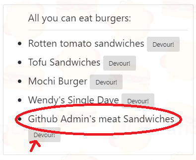

# Eat-Da-Burger

* Eat-Da-Burger! is a restaurant app that lets users input the names of burgers they'd like to eat.

* Whenever a user submits a burger's name, your app will display the burger on the left side of the page -- waiting to be devoured.

* Each burger in the waiting area also has a `Devour!` button. When the user clicks it, the burger will move to the right side of the page.

* Your app will store every burger in a database, whether devoured or not.

* Step 1: Enter the hamburger you want to eat:

* Step 2: Click to eat the sandwiches:

* Step 3: Now you ate something great!:

